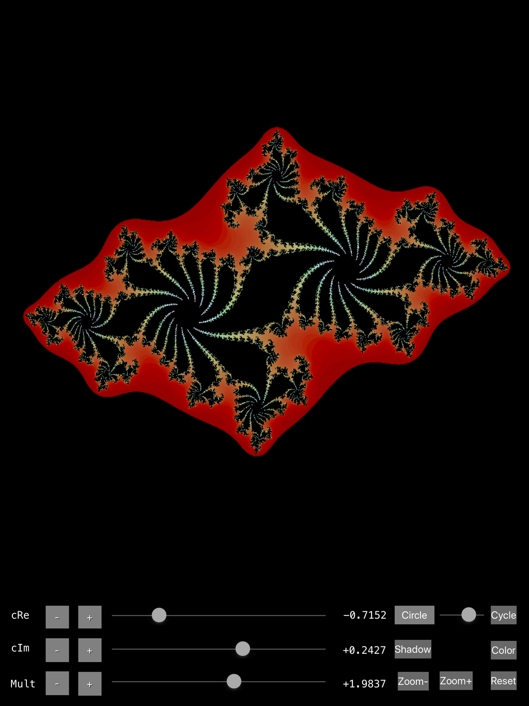

# JuliaCircle
IOS  Julia Set renderer using Swift and Metal

Good beginner project to practice with Swift 4 and Metal on the iPad.
Demonstrates a Metal compute shader for rendering the Julia set to a texture, which Swift transfers to a UIImage for display.
A second compute shader adds optional shadowing and kalideoscope reflections.

Note: Mark reminded me to mention that you need to disable Metal Validation in the Scheme.
Cmd-Option-R,  "Options",  Metal API Validation  Disabled.

